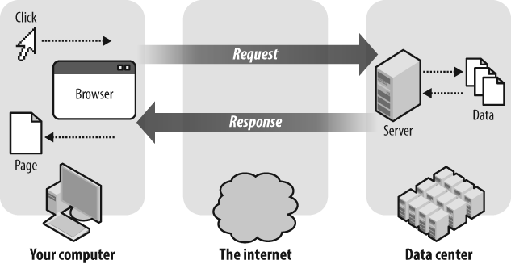
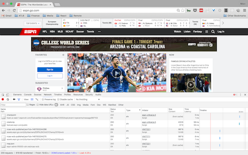

  
# WDIR Info Session Code Along

## Agenda + Objectives
* [Describe the Request Response Cycle](#request-response)
* [Differentiate between HTML, CSS and Javascript](#html-css-js)
* [Build a webpage using HTML, CSS and Javascript](#build)
* [Run/Load your code in the browser](#run)
* [Conclusion](#conclusion)

<br>

## Housekeeping to get started
* Download the Atom code editor
	* MAC — https://atom.io/download/mac
	* WINDOWS — https://atom.io/download/windows
* When I share my screen it will automatically become full screen, which isn't conducive to you typing along. You can double click your screen to make it smaller and double click again to return to full size.
* The first half of this lesson will be theory and the second will be practical. When we get the practical section you will be asked to write some code! Don't sweat it and be careful to not have any typos, punctuation and spelling are critical to your code working and is the very first thing developers need to learn to focus on!

## <a name="request-response">The request/response cycle</a>

Let's talk about what happens when we go to a webpage.

I'd like you to type your response and send it in the chat box. And if you'd like to come off mic and give your answer type that into the chat box as well.

**Question**: What do we need to do to actually arrive at a website?

**Question**: And what happens when we go through that process? Be as technical or not technical as you want.

The **request/response cycle** is how your browser retrieves files from a server and renders a webpage.

<br>


<br>

I'd like you all to open a new tab or window in chrome and go to www.espn.com.

When you hit enter to visit [ESPN](www.espn.com) you're browser makes a **request** to a server that's located somewhere on the internet. Espn.com is merely an alias for the server's actual IP (Internet Protocol) address which is `http://68.71.212.186/`. I would never remember that! If you enter that address into the browser it will make the exact same request as `www.espn.com`

Once the server receives your request it then sends you a **response** that generally consists of **HTML, CSS and Javascript** files. _We also receive other files like images, video, ads, etc._.

Your browser takes the files received and renders (just a technical term for display) a webpage for you to view and interact with.

<br>


- Copy and paste `68.71.212.186` into your browser URL. Where does it take you?
- Let's open the **Chrome Developer Tools** (option + command + i) and select the **Network** tab. Notice all of the files that are being sent back to us in the response from ESPN!
	- Or you can got to view > developer > developer tools (Should be in a similar location if you're on a pc or in a different browser)

<br>



<br>


Using the same method as before, type your response to the chat box and/or type if you'd like to come off mic to share your response.

1. Describe the request/response cycle in your own words.
2. What are the three file types that compose a basic webpage (hint... we're about to build a site with these three types)?

<br>

## <a name="html-css-js">Our webpage ingredients: HTML + CSS + Javascript</a>

Most webpages (at a minimum) consist of HTML, CSS and Javascript files.

- **HTML** stands for Hyper Text Markup Language. We use HTML tags to create HTML elements which give our page structure. You can think of HTML as the **BONES** of our page.
- **CSS** stands for Cascading Style Sheets. You can think of CSS as the **SKIN** of our page. CSS consists of **rules** that determine the color, fonts, and sizes of our HTML elements.
- **Javascript** dictates the behavior of our webpage. You can think of Javascript as the **BRAIN** of a webpage. It allows events to happen when we click on a button to submit a form.


You could also think of it as HTML being the **NOUNS**, CSS being the **ADJECTIVES**, and Javascript being the **VERBS**
<br>


<br>

Our browser **bakes** these **ingredients** (files) together to render a webpage.

<br>


## <a name="build">Build a webpage using HTML, CSS and Javascript</a>

**Question**: Has anyone heard of these terms? Has anyone built a website using HTML, CSS and Javascript?

In Atom we're gonna build a webpage that contains HTML, CSS and Javascript so we can see what each does for us. We'll walk through each of the steps below together.

To start, I'm going to share my screen so you can follow along with what I'm typing. You won't be able to copy any code, but I will give you time to to code along.

1. Create new folder on your Desktop titled wdi-first-app

2. Let's create a new file in `wdi-first-app` named `index.html`.

3. Open `wdi-first-app` directory in Atom. You can click and drag it your Atom app or open Atom and select File > Open and pick the directory

4. In your `index.html`, type in `!` then hit Tab. It should auto create a basic HTML structure. Next, inside the `<html>` tags, add `<head>` and `<body>`. Finally, inside the `body` of our page, let's add an `h1` tag that says "Hello World!". Our HTML markup should look like so:

	```html
	<!DOCTYPE html>
	<html>
	  <head>

	  </head>
	  <body>
	    <h1>Hello World!</h1>
	  </body>	    
	</html>
	```

	Great, now we've got a great basic starter structure using HTML tags! Let's see it in action. Your browser is able to open files locally. And based on what we learned earlier, this shouldn't be too surprising. When we go to ESPN.com we're making a request for an html file from another server. In this case we're just going to give the browser an html file.

	Go to your finder and find the index.html file. You <a name="run">can click and drag it into Chrome</a>, but you can also just double click the file and should open in your default browser.


4. Let's change the color and font of our "Hello World!" by adding some CSS. Normally, we'd want to put our CSS rules in a separate file, but today we're gonna add them inside our `head` tags:

	```html
	<!DOCTYPE html>
	<html>
	  <head>
	    <style type="text/css">
		   h1 {
			  font-family: Georgia;
			  color: green
			}
		 </style>
	  </head>
	  <body>
		 <h1>Hello World!</h1>
     </body>
   </html>
	```

	The browser in Chrome won't look any different because it won't automatically detect and and show your changes.

	But if you refresh the window it should reflect the changes you just made. If it doesn't, make sure you saved the file and that you don't have any typos!

	Finally, let's add a button that will use Javascript to alert your name. Again, normally we'd want to create a separate file for this, but today we're gonna put it within `<script>` tags in our HTML.


5. Let's add a `button` element to our page and a Javascript [onclick](http://www.w3schools.com/jsref/event_onclick.asp) event. When our button is clicked, it'll fire off a browser alert. Let's add the code below:

	```html
	<button onclick="alert('Hello World!')">Click me!</button>
	// add the button inside the body of your page, just below your h1
	```

<br>

## <a name="bonus"></a>

If you're feeling super confident, here are a few bonus suggestions...

1. Add an [external image to your page](http://www.w3schools.com/tags/tag_img.asp)
2. Try adding a [todo list](http://www.w3schools.com/html/html_lists.asp)
3. Try to move your CSS rules to an [external stylesheet](http://www.w3schools.com/css/css_howto.asp)

<br>
## <a name="conclusion"></a>

Great work! Keep going! Here are some additional resources.

- [W3 Schools HTML Tutorial](http://www.w3schools.com/html/default.asp)
- [W3 Schools CSS Tutorial](http://www.w3schools.com/css/default.asp)
- [W3 Schools Javascript Tutorial](http://www.w3schools.com/js/default.asp)
- [Request Response Cycle](http://celineotter.azurewebsites.net/world-wide-web-http-request-response-cycle/)
